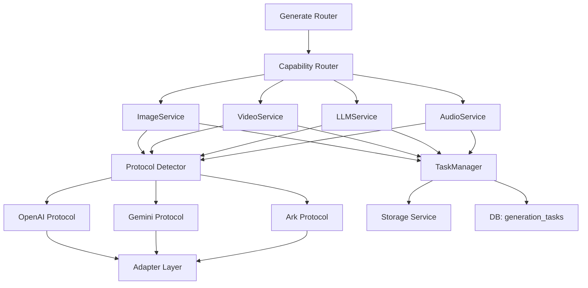

## 产品概述

将当前"按厂商拆 Provider"的 AI Gateway 后端架构，重构为 Capability + Protocol + Adapter + TaskManager + Storage 的通用架构。用户只需配置 {base_url, api_key, protocol, model} 即可调用 Image / Video / LLM / Audio 四种能力，后端自动完成路由、协议调用、同步/异步判断、轮询、资源下载落盘和状态更新。

## 核心功能

- **Capability 路由**：按 image / video / llm / audio 能力分发，Capability 层不感知上游厂商
- **Protocol 协议层**：OpenAI / Gemini / Ark 三种协议，负责构造 HTTP 请求、解析响应、提取同步结果或异步 task_id、生成轮询 URL
- **Adapter 适配层**：处理模型特殊参数（如 Seedance 的 duration、NanoBanana 的 reference_images），不侵入 Protocol
- **TaskManager 任务管理**：统一内部任务生命周期，同步优先异步兜底策略，自动轮询
- **Storage 资源管理**：上游资源下载后落本地存储，返回自己的 URL，未来可扩展 MinIO/OSS/S3
- **协议自动检测**：用户配置 > model metadata > base_url 指纹 > 默认 OpenAI
- **状态统一**：所有上游 status 统一 lower()，映射到 pending / completed / failed
- **通用 task_id 提取**：BaseProtocol 提供默认 extract_task_id()，支持 task_id / data.task_id / data[0].task_id，对 id 字段谨慎处理（仅当 status 为 pending 类时才用）
- **HTTP 异常容忍**：HTTP 非 200 时不直接失败，若错误响应中存在 task_id 则继续轮询

## Tech Stack

- FastAPI + Python 3.12 + httpx.AsyncClient + SQLAlchemy 2.0 async + SQLite（复用现有技术栈）

## Implementation Approach

### 核心策略：同步优先，异步兜底

删除 `is_async_provider()` 判断。每次调用上游后：

1. 先尝试 `protocol.extract_result(data)` -- 成功则直接完成（同步模式）
2. 失败则尝试 `protocol.extract_task_id(data)` -- 存在则进入轮询（异步模式）
3. 两者都无则报错"协议未返回结果"

### 协议检测优先级

1. 用户在 channel 上配置的 protocol（最高）
2. model metadata 推断（从 model_capabilities 服务扩展）
3. base_url 指纹匹配（generativelanguage -> gemini, volces/ark -> ark）
4. 默认 openai

### 向后兼容策略

- `GenerationTask` 表扩展字段（capability, protocol, model, upstream_task_id），`type` 字段保留作为 capability 别名
- `generate.py` 路由接受 `type` 或 `capability`，`type` 自动映射
- SSE 流、cancel 接口完全不动
- bg_removal 保持独立逻辑不迁移
- `ModelChannel` 新增 `protocol` 字段（nullable）
- 旧 providers/ 过渡期共存，Phase 7 后删除

## Implementation Notes

- 复用现有 SSRF 防护、DNS pinning、慢速检测、指数退避重试
- 复用 `storage.py` 的 `save_upload_bytes()`，gateway/storage.py 包装调用
- 复用 `model_capabilities.py`，扩展增加协议推断
- worker 中 `_resolve_refs()`、`_read_self_file()`、`_post_with_retry()` 迁移到 gateway/http_utils.py
- 数据库迁移使用 ALTER TABLE ADD COLUMN（SQLite 兼容）
- 每个 Phase 完成后运行测试验证

## Architecture Design



## Directory Structure

```
backend/app/services/
├── gateway/                          # [NEW] Gateway 核心
│   ├── __init__.py
│   ├── router.py                     # CapabilityRouter - 按 capability 分发
│   ├── task_manager.py               # TaskManager - 提交、轮询、状态更新
│   ├── storage.py                    # StorageService - 包装 download_and_save
│   ├── protocol_detector.py          # 协议自动检测
│   ├── status.py                     # 状态归一化
│   ├── types.py                      # PollResult, SyncResult, AsyncSubmission, TaskStatus
│   └── http_utils.py                 # _post_with_retry + _resolve_refs + _read_self_file
├── protocols/                        # [NEW] 协议层
│   ├── __init__.py                   # 协议注册表 get_protocol(name, capability)
│   ├── base.py                       # BaseProtocol 抽象基类
│   ├── openai/
│   │   ├── base.py                   # OpenAIBaseProtocol 共享 helpers
│   │   ├── image.py                  # OpenAIImageProtocol
│   │   ├── llm.py                    # OpenAILLMProtocol
│   │   └── audio.py                  # OpenAIAudioProtocol
│   ├── gemini/
│   │   ├── base.py
│   │   ├── image.py
│   │   └── llm.py
│   └── ark/
│       ├── base.py
│       ├── image.py
│       └── video.py
├── capabilities/                     # [NEW] 能力层
│   ├── base.py                       # BaseCapabilityService
│   ├── image/service.py
│   ├── video/service.py
│   ├── llm/service.py
│   └── audio/service.py
├── adapters/                         # [NEW] 模型适配层
│   ├── base.py                       # BaseAdapter
│   ├── gpt_image.py
│   ├── nano_banana.py
│   ├── seedance.py
│   ├── agnes_video.py
│   └── apimart_image.py
├── providers/                        # [MODIFY->最终 DELETE] 过渡期保留
├── worker.py                         # [MODIFY] 重构 _process_task
├── storage.py                        # [KEEP]
├── model_capabilities.py             # [MODIFY] 增加协议推断
├── ssrf.py                           # [KEEP]
└── http.py                           # [KEEP]

backend/app/models/
├── task.py                           # [MODIFY] 增加 capability, protocol, model, upstream_task_id
└── model_config.py                   # [MODIFY] ModelChannel 增加 protocol

backend/app/routers/
├── generate.py                       # [MODIFY] 支持 capability 参数
└── ai_proxy.py                       # [MODIFY] LLM 走 gateway
```

## Key Code Structures

```python
# gateway/types.py
class TaskStatus(str, Enum):
    CREATED = "created"
    SUBMITTED = "submitted"
    PROCESSING = "processing"
    COMPLETED = "completed"
    FAILED = "failed"
    TIMEOUT = "timeout"

@dataclass
class PollResult:
    status: str  # "pending" | "completed" | "failed"
    urls: list[str] | None = None
    raw_bytes: list[bytes] | None = None
    error: str | None = None
```

```python
# protocols/base.py
class BaseProtocol(ABC):
    protocol_name: str = ""

    @abstractmethod
    def build_request(self, params: dict) -> tuple[str, dict, dict]:
        """Returns (endpoint_suffix, headers, body)"""

    @abstractmethod
    def extract_result(self, data: dict) -> tuple[list[str], list[bytes]] | None:
        """Try to extract sync results. Returns (urls, raw_bytes) or None."""

    def extract_task_id(self, data: dict) -> str | None:
        """Default: task_id, data.task_id, data[0].task_id.
        For 'id': only if status is pending-type."""
        # Direct task_id
        tid = data.get("task_id")
        if tid: return str(tid)
        inner = data.get("data")
        if isinstance(inner, dict) and inner.get("task_id"):
            return str(inner["task_id"])
        if isinstance(inner, list) and inner and isinstance(inner[0], dict):
            tid = inner[0].get("task_id")
            if tid: return str(tid)
        # 'id' field - cautious: only if status indicates pending
        id_val = data.get("id")
        if id_val:
            status = str(data.get("status", "")).lower()
            if status in PENDING_STATUSES:
                return str(id_val)
        return None

    @abstractmethod
    def build_poll_url(self, base_url: str, task_id: str) -> str: ...

    @abstractmethod
    def parse_poll_response(self, data: dict) -> PollResult: ...

    @abstractmethod
    def supports(self, capability: str) -> bool: ...
```

```python
# adapters/base.py
class BaseAdapter(ABC):
    @abstractmethod
    def adapt_body(self, body: dict, model: str) -> dict: ...
    @abstractmethod
    def matches(self, model: str) -> bool: ...
```