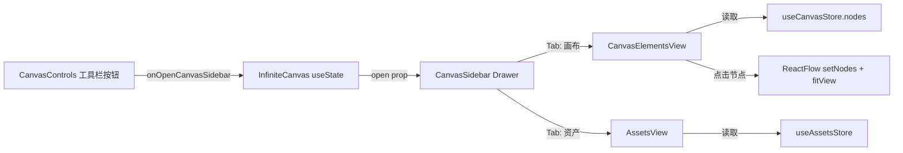

## 产品概述

在画布左侧新增一个划入式侧面板（CanvasSidebar），提供"画布元素"和"资产"两个 Tab 视图。用户通过左下工具栏新增的按钮触发面板滑入，实现快速浏览和定位画布节点，以及管理资产库。

## 核心功能

- **左侧划入面板**：使用 Ant Design Drawer，placement="left"，宽度约 320px，深色主题与现有 UI 一致
- **画布元素 Tab**：实时列出当前画布所有节点，按类型（导演台/图片/视频/文本/分组）分组显示，每个节点显示类型图标和名称（label），点击节点将视口居中到该节点并选中
- **资产 Tab**：嵌入现有资产库视图（基于 assets-store），显示资产列表/网格，支持搜索和切换分类
- **搜索过滤**：支持按名称搜索过滤节点列表
- **左下工具栏按钮**：在现有 CanvasControls 工具栏中新增按钮（AppstoreOutlined 图标），Tooltip 显示"画布"/"Canvas"

## 技术栈

- React 19 + Next.js（现有项目）
- @xyflow/react（画布引擎）
- Ant Design 5（Drawer、Input 组件）
- Zustand（canvas-store、assets-store 状态管理）
- TypeScript
- Tailwind CSS（布局）
- CSS 变量（--canvas-bg / --canvas-border / --canvas-text 等深色主题变量）

## 实现方案

### 整体策略

沿用项目中 ModelConfigModal 的 Drawer 实现模式，在 InfiniteCanvas 组件中新增 useState 控制 Drawer 的开关状态。Drawer 内部使用 Tab 切换结构，分别加载"画布元素"和"资产"两个视图。CanvasControls 组件新增一个 onOpenCanvasSidebar prop 来接入新按钮。

### 关键设计决策

1. **不使用 canvas-store 全局状态**：Drawer 的开/关属于纯 UI 状态，用 InfiniteCanvas 内部的局部 useState 管理即可，无需放入全局 store（与 assetsOpen、settingsOpen 保持一致）
2. **节点列表实时读取**：直接从 `useCanvasStore(s => s.nodes)` 读取，Zustand 的 selector 式订阅确保数据变化时列表自动更新
3. **资产 Tab 轻量嵌入**：第一版在 Drawer 内直接复用 AssetsModal 中的 AssetGrid + 搜索/分类逻辑，避免创建独立的资产列表组件（减少代码量和维护点）
4. **节点定位**：点击节点项时，通过 ReactFlow 的 `setNodes` 选中目标节点并取消其他选中，然后调用 `fitView` 或手动计算 `setViewport` 将视口居中到目标节点，确保节点可见

### 实现注意

- **性能**：节点列表使用 useMemo 按类型分组，避免每次渲染都重新遍历；列表项使用固定高度（44px），节点数量通常在 100 以内无需虚拟列表
- **键盘快捷键阻塞**：Drawer 开启时需同步设置 `modalOpen=true`（和 directorOverlayOpen 一样的模式），阻止画布快捷键
- **样式一致性**：Drawer 使用与 ModelConfigModal 相同的 CSS 变量注入模式（--canvas-bg, --canvas-border 等），复用已有的 dark theme 样式
- **稳健性**：Drawer 使用 `destroyOnClose` 确保关闭时卸载内容，避免 DOM 堆叠和性能泄漏

### 架构设计



## 目录结构

```
frontend/src/
├── components/canvas/
│   ├── CanvasControls.tsx          # [MODIFY] 新增 onOpenCanvasSidebar prop，新增 AppstoreOutlined 按钮
│   ├── InfiniteCanvas.tsx          # [MODIFY] 新增 canvasSidebarOpen useState，引入 CanvasSidebar，传递回调
│   └── CanvasSidebar.tsx           # [NEW] 左侧划入面板主组件
│       ├── 内部包含两个子视图
│       ├── CanvasElementsView      # 画布元素列表（内联在 CanvasSidebar 中或抽为独立组件）
│       └── AssetsView              # 资产视图（复用 assets-store）
├── stores/
│   └── i18n-store.ts              # [MODIFY] 新增 canvas sidebar 相关翻译 key
```

## 关键代码结构

### CanvasSidebar Props 接口

```typescript
interface CanvasSidebarProps {
  open: boolean;
  onClose: () => void;
}
```

### 画布节点列表项数据结构（内部使用）

```typescript
interface NodeItem {
  nodeId: string;
  label: string;
  type: typeof NODE_TYPE[keyof typeof NODE_TYPE];
}
```

### CanvasControls 新增 Props

```typescript
// 在现有 Props 接口中新增
interface Props {
  onOpenSettings?: () => void;
  onOpenAssets?: () => void;
  onOpenCanvasSidebar?: () => void;  // 新增
}
```

## 子代理

- **code-explorer**
- 用途：在实现阶段探索现有 AssetsModal 中可复用的资产列表渲染逻辑（AssetGrid、筛选、搜索），确保资产 Tab 的嵌入方式符合现有架构
- 预期结果：明确哪些子组件可直接复用、哪些需要适配 Drawer 容器

## 技能

- **codebase-design**
- 用途：在设计 CanvasSidebar 内部模块接口和 Tab 切换状态管理时，参考深度模块设计原则，确保组件接口简洁、职责单一
- 预期结果：CanvasSidebar 的接口清晰（open/onClose），内部子视图独立可替换