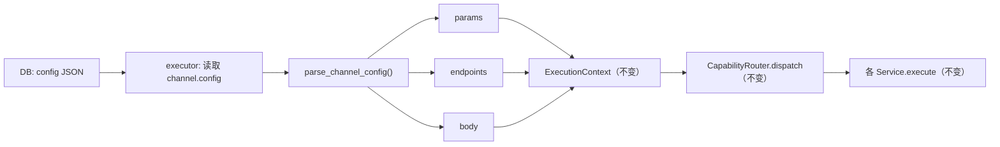

## 需求概述

将 `ModelChannel` 表中的三个独立 JSON 字段合并为一个 `config` JSON 列，同时将 Presets 从 Python 代码迁移到 JSON 文件。

## 核心变更

### 1. 三字段合并为 config

将 `parameter_mapping`、`endpoint_mapping`、`override_json` 合并为 `config` JSON 列，内部三层结构：

```
{
    "params": { "image_urls": "extra_body.image", "__models__": {...} },
    "endpoints": { "image.generate": "/custom/images" },
    "body": { "extra_body": { "response_format": "url" } }
}
```

| 旧 key | 新 key | 作用 |
| --- | --- | --- |
| `parameter_mapping` | `params` | 字段重命名/删除 |
| `endpoint_mapping` | `endpoints` | 覆盖默认端点路径 |
| `override_json` | `body` | 注入/覆盖请求体字段 |


### 2. Presets 迁移到 JSON

`app/services/presets.py`（Python 写死的 dict）→ `app/data/presets.json`（纯数据文件），后端路由改为从 JSON 文件加载。

### 3. 前端简化

渠道配置表单从 3 个 tab 分栏的 JSON 输入框 → 1 个 textarea，一次性输入整个 config JSON。

## 技术方案

### 整体架构

**变更面最小化策略**：在 executor 边界拆包。数据库存储合并后的 `config` JSON，executor 读取后立即拆为 `params`/`endpoints`/`body`，上下文（ExecutionContext）、Gateway 层、Service 层签名完全不变，仅 4 个 capability service 的调用方式零改动。



### 实现细节

#### 1. 新增 `parse_channel_config()` 公共函数

在 `adapters/mapping.py` 中新增：

```python
def parse_channel_config(raw: dict | None) -> tuple[dict, dict, dict]:
    """将合并后的 config JSON 拆为 params/endpoints/body 三元组。
    
    返回: (params, endpoints, body)
    """
    if not raw:
        return {}, {}, {}
    return raw.get("params", {}), raw.get("endpoints", {}), raw.get("body", {})
```

#### 2. executor 拆包点

`executor.py` 中原来读三个字段：

```python
parameter_mapping = channel.parameter_mapping
endpoint_mapping = channel.endpoint_mapping
override_json = channel.override_json
```

改为：

```python
from app.services.adapters.mapping import parse_channel_config
parameter_mapping, endpoint_mapping, override_json = parse_channel_config(channel.config)
```

#### 3. DB 迁移策略

项目有两套迁移机制：

- **Alembic**：正式版本迁移（`alembic/versions/`）
- **`db_migrate.py`**：启动期幂等补列（开发兜底）

迁移步骤：

1. 新建 Alembic 迁移文件：`ALTER TABLE model_channels ADD COLUMN config JSON`
2. 数据迁移 SQL：将旧 3 列数据 JSON 合并写入 `config`
3. 删除旧 3 列：`ALTER TABLE model_channels DROP COLUMN parameter_mapping` 等
4. 更新 `db_migrate.py`：新增 `config` 到预期列列表，移除旧的 3 项

旧数据的合并逻辑（SQL 级）：

```sql
UPDATE model_channels
SET config = json_object(
    'params', COALESCE(parameter_mapping, '{}'),
    'endpoints', COALESCE(endpoint_mapping, '{}'),
    'body', COALESCE(override_json, '{}')
)
WHERE config IS NULL;
```

#### 4. Presets JSON 格式

```
[
    {
        "name": "Agnes",
        "baseUrl": "https://apihub.agnes-ai.com/v1",
        "protocol": "openai",
        "config": {
            "params": {"image_urls": "extra_body.image"},
            "body": {"extra_body": {"response_format": "url"}}
        }
    }
]
```

Router 改为 `json.loads(path.read_text())` 加载，删除 `from app.services.presets import PROVIDER_PRESETS`。

#### 5. DB 列类型使用 VARCHAR 替代 JSON

SQLite 的 `ALTER TABLE ADD COLUMN` 不支持 `JSON` 类型名。考虑到项目目前使用 SQLite，且 `db_migrate.py` 也使用字符串类型名，`config` 列将使用 `"JSON"` 类型名（与现有 `parameter_mapping`/`endpoint_mapping`/`override_json` 一致）。

### 性能考量

- `parse_channel_config()` 是纯字典访问 + dict.get，O(1)，无性能影响
- 旧数据迁移为一次性 SQL UPDATE，对运行时无影响
- JSON 列合并后 DB 读写次数不变（原来 3 列各读一次，现在 1 列读一次再拆包）

### 涉及文件

#### 后端（11 个文件）

| 文件 | 操作 | 说明 |
| --- | --- | --- |
| `app/data/presets.json` | 新建 | Presets 数据文件 |
| `app/services/presets.py` | 删除 | 替换为 JSON 文件 |
| `app/models/model_config.py` | 修改 | 3 列 → 1 列 |
| `app/schemas/model_config.py` | 修改 | 3 field → 1 field |
| `app/crud/model_config.py` | 修改 | 3 参数 → 1 参数 |
| `app/routers/model_config.py` | 修改 | API 返回/接收改为 config |
| `app/services/worker/executor.py` | 修改 | 拆包逻辑 |
| `app/services/adapters/mapping.py` | 修改 | 新增 parse_channel_config() |
| `app/services/db_migrate.py` | 修改 | 新增 config 列 |
| `alembic/versions/` | 新建 | DDL 迁移脚本 |
| `tests/test_gateway_architecture.py` | 修改 | 更新测试用例 |


#### 前端（4 个文件）

| 文件 | 操作 | 说明 |
| --- | --- | --- |
| `lib/types.ts` | 修改 | 3 字段 → 1 config 字段 |
| `stores/model-store.ts` | 修改 | 3 参数 → 1 config 参数 |
| `components/canvas/ModelConfigModal.tsx` | 修改 | 3 tab → 1 textarea |
| `stores/i18n-store.ts` | 修改 | 删除旧的 3 个 i18n key |